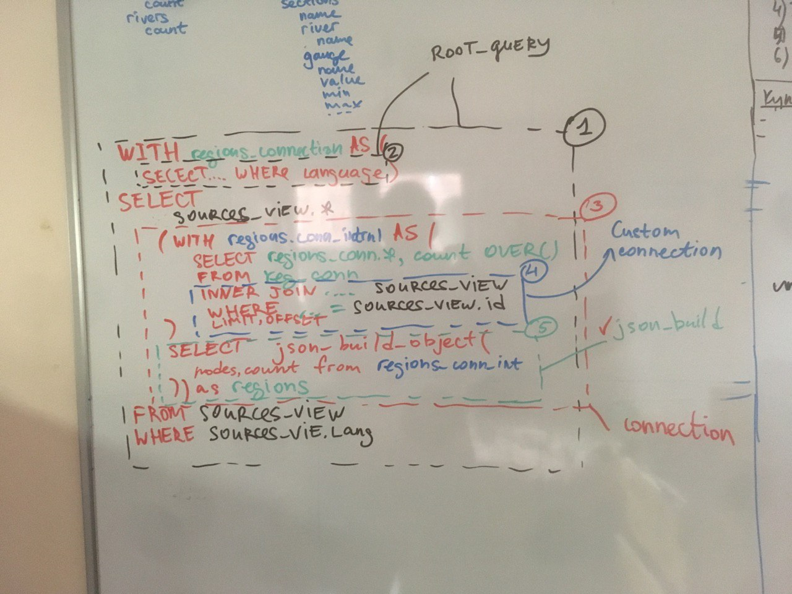

# Query builder

Query builder is used to build deeply nested sql queries to match graphql queries

# How it works



Consider following example graphql query:
```$graphql
query {
    sources {
        id
        name
        regions { // <--- connection to regions
            nodes {
                id
                name
            }
            count
        }
    }
}
```

1. Start building SQL query with some table. This is `root query`
2. Walk query tree and determine root field names. Some of them are simple columns, 
they are added to root query's `SELECT` clause. See `getPrimitives`
3. Others are connection fields. For each connection field `attachConnection` function runs.
As a result:
    1. CTE to select connection nodes is added to root query. This CTE is a `root query itself`.
    `build` property of connection map is used to build this CTE. *(2 on the picture)*
    2. Connection field is added to `SELECT` clause of `root query` as a subquery
    alongside primitive columns.
    This subquery is build with `buildConnectionColumn` function. *(3 on the picture)*
        1. In turn, this connection column subquery is composed of two parts
        2. The first part is another, inner CTE, to select and count nodes from outer CTE.
        Using `join` property of connection map *(4 on the picture)*, inner CTE is filtered to get connected to 
        table from `root query`. This is done by simply adding `WHERE` clause for one-to-many connections
        or by joining junction table and adding `WHERE` clause for many-to-many connections.
        It can also paginate (via `LIMIT/OFFSET`).
        3. The connection column is produced by building json from inner CTE.
        This is done in `buildConnectionJSONQuery` function. *(5 on the picture)*
4. As a result, a massive nested sql query is produced *(1 on the picture)*